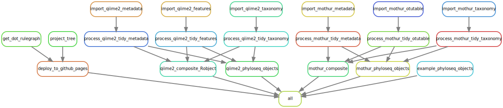

<link rel="preconnect" href="https://fonts.googleapis.com">
<link rel="preconnect" href="https://fonts.gstatic.com" crossorigin>
<link href="https://fonts.googleapis.com/css2?family=Montserrat&display=swap" rel="stylesheet">
<link rel="preconnect" href="https://fonts.googleapis.com/css2?family=Anton&display=swap" rel="stylesheet">

```{r echo=FALSE, message=FALSE, warning=FALSE}
knitr::opts_chunk$set(
  echo = FALSE,
  message = FALSE,
  warning = FALSE,
  cache = FALSE,
  comment = NA,
  fig.path='./figures/',
  fig.show='asis',
  dev = 'png',
  fig.align='center',
  out.width = "70%",
  fig.width = 7,
  fig.asp = 0.7,
  fig.show = "asis"
)

library(tidyverse, suppressPackageStartupMessages())
library(schtools)

```


<br><div id="inprogress"><h2> --- Work In Progress! --- </h2> </div><br><br>

> We continuously review and integrate the old iMAP [@TMBuza2019] with Snakemake and GitHub actions to facilitate reproducible microbiome data analysis!

<br><hr width=100%><br>

# General Overview

- We use the snakemake workflow management system [@Koster2021; @Snakemake2023] for:
  - Maintaining reproducibility in technical validation and regeneration of results.
  - Creating scalable data analysis scaled to server, grid or cloud environment.
  - Fostering sustainable improvement of the microbiome data analysis.
- We also review existing workflows [@Snakemake2023; @Mothursnakemake] to help in gaining a better insights for improving microbiome data analysis.
- We break any complex workflows into small contiguous but related chunks where each major step form a separate executable snakemake rule.

<br>

> We envision to keep fostering on continuous integration and development of highly reproducible workflows.

<!--  -->


<br>

## Snakemake rule-graph
- Typically the snakemake workflow is defined by specifying rules.
- The rule-graph graphically shows the input-output files. 
- The snakemake is capable of automatically determining the dependencies between the rules and creates a dot-like DAG (Directed Acyclic Graph).

<br><br>
IMAP-PART3: Snakemake workflow

<br><br>

## Screenshot of interactive snakemake report {#smkreport}
> The snakemake html report can be viewed using any compartible browser, such as chrome to explore more on the workflow and the associated statistics. You will be able to close the left bar to get a better view of the dispaly.


<br><hr width=100%><br>


# Appendix {-}

## Troubleshooting (in progress)
<ol>
  <li>?</li>
  <ul>
    <li></li>
  </ul>

  <li>?</li>
  <ul>
    <li></li>
  </ul>

  <li>?</li>
  <ul>
    <li></li>
  </ul>
</ol>

<br><br><hr width=50%><br>

## References
::: {#refs}
:::

<br><br><hr width=100%><br>

<div id="footer">
Last updated on `r format(Sys.time(), '%B %d, %Y')`. <br><br>
The snakemake workflow mentioned in this report is continuously being reviewed, integrated, tested and compiled by [`r rmarkdown::metadata$author`](mailto:`r rmarkdown::metadata$email_address`).  
Github_Repo: `r rmarkdown::metadata$github_repo`.  
Related Website: `r rmarkdown::metadata$related_website`.  

</div><br><br>
